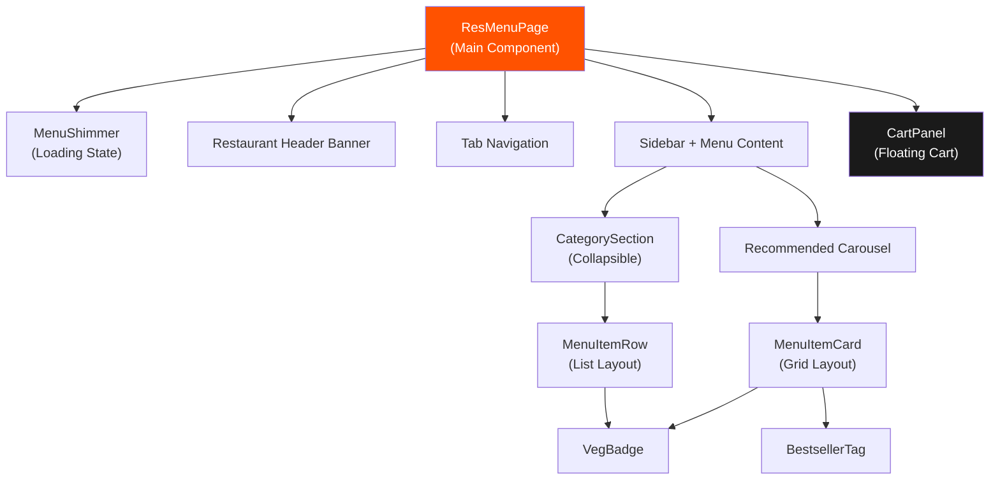
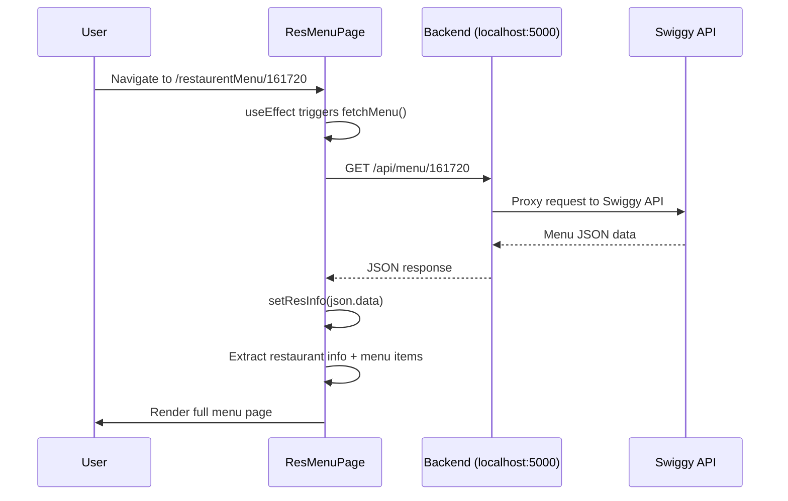

# 🍽️ Restaurant Menu Page — Detailed Implementation Report

> **Prepared for Interview Reference** — Everything you need to explain confidently about the ResMenuPage feature.

---

## 📂 Files Modified

| File | Action | Purpose |
|------|--------|---------|
| [ResMenuPage.js](file:///d:/180-days-dev/REACT%20JS/Namaste%20React/FoodOrderingWebsite/src/components/pages/ResMenuPage.js) | **Rewritten** | Complete restaurant menu page component |
| [styles.css](file:///d:/180-days-dev/REACT%20JS/Namaste%20React/FoodOrderingWebsite/styles.css) | **Appended** | ~1200 lines of CSS for the menu page |

No other files were changed. The route `/restaurentMenu/:resId` was already configured in [App.js](file:///d:/180-days-dev/REACT%20JS/Namaste%20React/FoodOrderingWebsite/src/App.js#L55).

---

## 🏗️ Architecture Overview



---

## 🧩 Components Breakdown (7 Components in 1 File)

### 1. `ResMenuPage` — The Main Container

> **Interview Answer:** *"ResMenuPage is the main parent component. It uses `useParams()` from React Router to extract the `resId` from the URL, fetches menu data from our backend proxy, and orchestrates all child components."*

**Key React concepts used:**
- `useState` — manages `resInfo`, `activeTab`, `activeCategory`, `cartItems`
- `useEffect` — triggers API call on mount and when `resId` changes
- `useParams` — extracts dynamic route parameter `:resId`
- `useRef` — references the carousel DOM element for scroll control

```js
const { resId } = useParams();                    // Dynamic routing
const [resInfo, setResInfo] = useState(null);      // API data
const [cartItems, setCartItems] = useState({});    // Cart state as { itemId: qty }
const recommendedRef = useRef(null);               // Carousel scroll ref
```

### 2. `MenuShimmer` — Skeleton Loading State

> **Interview Answer:** *"Instead of showing a blank page or a simple 'Loading...' text, I created a skeleton shimmer UI that mimics the actual page layout — header, sidebar, and menu grid — using CSS pulse animations. This gives the user a sense of the content structure before it loads."*

**Why it matters:** It prevents Cumulative Layout Shift (CLS), a Core Web Vital metric.

### 3. `VegBadge` — Veg/Non-Veg Indicator

> **Interview Answer:** *"This is a small presentational component that shows a green square with a dot for veg items and a red one for non-veg, matching the Swiggy/Zomato design pattern. It receives a single `isVeg` boolean prop."*

```js
const VegBadge = ({ isVeg }) => (
  <span className={`veg-badge ${isVeg ? "veg" : "nonveg"}`}>
    <span className="veg-badge-dot" />
    {isVeg && <span className="veg-badge-label">Veg</span>}
  </span>
);
```

### 4. `BestsellerTag` — Conditional Badge

> **Interview Answer:** *"Items with a rating of 4.4 or higher automatically get a 'Bestseller' tag overlaid on their image. It's a conditional rendering pattern — if the rating doesn't meet the threshold, the component returns `null`."*

### 5. `MenuItemCard` — Grid Card (Recommended Section)

> **Interview Answer:** *"For the 'Recommended for you' horizontal carousel, I used a card-based layout. Each card shows the food image, name, description, price, veg/non-veg badge, and an ADD button. When the user clicks ADD, it switches to a quantity counter with +/- buttons."*

**Key interaction flow:**
```
[ADD +] → Click → [- 1 +] → Click + → [- 2 +] → Click - → [- 1 +] → Click - → [ADD +]
```

### 6. `MenuItemRow` — List Row (Category Sections)

> **Interview Answer:** *"Below the carousel, each food category (Starters, Biryani, etc.) shows items in a row/list layout with a thumbnail, description, price, and ADD button — similar to Swiggy's actual menu layout."*

### 7. `CategorySection` — Collapsible Accordion

> **Interview Answer:** *"Each category is an accordion-style collapsible section. I used `useState(defaultOpen)` to control open/close state. The first 3 categories start open, the rest start closed. There's also a 'View all' button if a category has more than 4 items."*

```js
const [isOpen, setIsOpen] = useState(defaultOpen);    // Collapse/expand
const [showAll, setShowAll] = useState(false);         // Show 4 items vs all
const displayItems = showAll ? items : items.slice(0, 4);
```

### 8. `CartPanel` — Floating Cart

> **Interview Answer:** *"The cart is a fixed-position floating panel at the bottom-right. It appears with a slide-in animation when the user adds their first item. It shows item count and expands on click to show cart details — each item with quantity controls, subtotal, and a 'View Cart' button."*

**Animation:** Uses CSS `@keyframes cartSlideIn` with `cubic-bezier` for a bouncy entrance.

---

## 🔄 Data Flow & State Management

### How Data is Fetched



### How Menu Items are Extracted from Swiggy's API Structure

> **Interview Answer:** *"Swiggy's API response has a deeply nested structure. The restaurant info is in `data.cards[0].card.card.info`. The menu items are nested inside a `groupedCard` object under `cardGroupMap.REGULAR.cards`. Each card can have `itemCards` (direct items) or `categories` (sub-groups with their own itemCards). I iterate through both to collect all items into a flat array."*

```js
// Extracting items from Swiggy's nested API structure:
const groupedCard = resInfo?.cards?.find((c) => c?.groupedCard);
const regularCards = groupedCard?.groupedCard?.cardGroupMap?.REGULAR?.cards || [];

regularCards.forEach((card) => {
  // Direct items in a card
  const itemCards = card?.card?.card?.itemCards || [];
  itemCards.forEach((ic) => allMenuItems.push(ic.card.info));
  
  // Items nested inside sub-categories
  const categories = card?.card?.card?.categories || [];
  categories.forEach((cat) => {
    cat.itemCards?.forEach((ic) => allMenuItems.push(ic.card.info));
  });
});
```

### Cart State Management

> **Interview Answer:** *"The cart uses a simple object `{ itemId: quantity }` pattern with `useState`. When the user clicks ADD, we increment the count. When they click minus, we decrement it. If it reaches 0, we delete the key entirely. This pattern is efficient because lookups are O(1)."*

```js
// Cart state: { "101001": 2, "101005": 1 }

const handleAddItem = (item) => {
  setCartItems((prev) => ({
    ...prev,
    [item.id]: (prev[item.id] || 0) + 1,  // Increment or start at 1
  }));
};

const handleRemoveItem = (itemId) => {
  setCartItems((prev) => {
    const newQty = (prev[itemId] || 0) - 1;
    if (newQty <= 0) {
      const next = { ...prev };
      delete next[itemId];  // Clean up empty entries
      return next;
    }
    return { ...prev, [itemId]: newQty };
  });
};
```

---

## 🎨 CSS Architecture

### Page Sections Styled

| Section | CSS Class Prefix | Lines Added |
|---------|-----------------|-------------|
| Restaurant Header Banner | `.resmenu-header-*` | ~200 lines |
| Tab Navigation | `.resmenu-tab*` | ~50 lines |
| Category Sidebar | `.resmenu-sidebar*` | ~70 lines |
| Recommended Carousel | `.resmenu-recommended*`, `.carousel-*` | ~80 lines |
| Menu Item Card (grid) | `.menu-item-card*` | ~80 lines |
| Menu Item Row (list) | `.menu-item-row*` | ~80 lines |
| Veg/Non-Veg Badge | `.veg-badge*` | ~40 lines |
| ADD/Quantity Controls | `.add-btn`, `.qty-*` | ~60 lines |
| Category Accordion | `.menu-category-*` | ~80 lines |
| Floating Cart Panel | `.cart-panel*` | ~120 lines |
| Shimmer Loading | `.resmenu-shimmer*` | ~80 lines |
| Responsive Breakpoints | `@media` queries | ~100 lines |

### Key CSS Techniques Used

> **Interview Answer:** *"I used CSS custom properties (variables) for consistent theming, `position: sticky` for the sidebar and tabs, flexbox for layout, CSS Grid for the shimmer skeleton, and `@keyframes` animations for the cart panel entrance. The recommended section uses a scrollable flex container with hidden scrollbars."*

1. **Dark gradient header:** `linear-gradient(135deg, #1a1a1a, #2d2019, #3e2a15)` with a `::before` pseudo-element overlay
2. **Sticky sidebar:** `position: sticky; top: 140px` with scroll container
3. **Hidden scrollbar carousel:** `scrollbar-width: none` + `::-webkit-scrollbar { display: none }`
4. **Bounce-in cart animation:** `cubic-bezier(0.34, 1.56, 0.64, 1)` — values > 1 create an overshoot effect
5. **Responsive design:** 3 breakpoints — 900px (sidebar → horizontal), 600px (cards shrink, mobile layout)

---

## ✨ Feature Walkthrough

### Feature 1: Restaurant Header Banner
- Dark gradient background matching Swiggy's design
- Circular logo with gradient and first 2 letters of restaurant name
- Cuisine tags as badge pills
- Rating, delivery time, cost-for-two in a meta row
- Address and open/closed status
- Heart (save) and share action buttons
- "FLAT 20% OFF" offer banner

### Feature 2: Tab Navigation
- 4 tabs: Menu, Reviews, Photos, About
- Sticky positioning below navbar
- Active tab has orange bottom border
- Only Menu tab shows content; others show "Coming Soon"

### Feature 3: Category Sidebar
- Fixed/sticky sidebar listing all food categories
- Active category highlighted with orange left border
- "Recommended" always at the top
- Clicking scrolls to that category section smoothly
- On mobile: converts to horizontal scrollable tab bar

### Feature 4: Recommended Carousel
- Horizontal scrollable carousel of top-rated items (rating ≥ 4.0)
- Items sorted by highest rating first
- Left/right arrow controls using `useRef` + `scrollBy()`
- Cards show image, name, description, price, veg badge, ADD button
- Bestseller tag on items rated ≥ 4.4

### Feature 5: Category Sections (Accordion)
- Collapsible sections with click-to-toggle
- Chevron rotates 180° when open
- First 3 categories open by default
- "View all (N)" button when > 4 items
- List-style rows with thumbnail, veg badge, description, price, ADD button

### Feature 6: Cart System
- Cart state managed with `{ itemId: quantity }` object
- ADD button transforms to ± quantity counter after first click
- Floating cart panel with dark header showing item count
- Expandable to show:
  - Each item with veg badge, name, price, quantity controls
  - Subtotal calculation
  - "View Cart" CTA button
- Slide-in animation when first item is added
- Fully synced — quantity changes reflect everywhere

---

## 🧪 React Concepts You Can Mention in the Interview

| Concept | Where Used | How |
|---------|-----------|-----|
| **Dynamic Routing** | `useParams()` | Extract `resId` from URL `/restaurentMenu/:resId` |
| **Side Effects** | `useEffect` | Fetch API data on mount, re-fetch on `resId` change |
| **State Management** | `useState` | 4 state variables: resInfo, activeTab, activeCategory, cartItems |
| **Refs** | `useRef` | Scroll control on the recommended carousel |
| **Conditional Rendering** | Throughout | Loading shimmer, bestseller tag, veg badge, cart visibility |
| **Lists & Keys** | Map functions | Menu items, categories, cart items — all use unique `key` props |
| **Props Drilling** | Cart handlers | `onAdd`/`onRemove` passed down to card/row components |
| **Component Composition** | Modular design | 7 focused components composed together |
| **Derived State** | Computed values | `recommendedItems`, `categoryMap`, `subtotal` computed from state |
| **Optional Chaining** | Data extraction | `resInfo?.cards?.[0]?.card?.card?.info` for safe nested access |

---

## 💡 Interview Q&A Cheat Sheet

### Q: "Walk me through how this page works."

> *"When the user clicks a restaurant card on the home page, React Router navigates to `/restaurentMenu/:resId`. The ResMenuPage component extracts the `resId` using `useParams()`, shows a shimmer skeleton while data loads, and fetches the menu from our backend proxy. Once data arrives, I extract the restaurant info from the first card in the API response, and all menu items from the deeply nested `groupedCard` structure. Items are grouped by category, sorted by rating for the recommended section, and rendered in two layouts — a horizontal card carousel for recommended items and list rows for each category. The user can add items to cart, which is managed as a simple `{ id: qty }` state object, and the floating cart panel stays in sync with all changes."*

### Q: "Why did you structure it as multiple small components?"

> *"Single Responsibility Principle. Each component handles one concern — VegBadge just renders a badge, MenuItemCard renders one card, CategorySection handles the collapse logic. This makes the code testable, reusable, and easy to debug. If I need to change how the veg badge looks, I change one component."*

### Q: "How does the cart state work without Redux or Context?"

> *"For a single-page menu, lifting state to the parent (ResMenuPage) is sufficient. The cart state is an object like `{ '101001': 2 }` where keys are item IDs and values are quantities. I pass `handleAddItem` and `handleRemoveItem` as props to child components. This is prop drilling, but at only 2 levels deep, it's simpler than adding Context or Redux for this scope."*

### Q: "How would you scale this?"

> *"If the app grew, I'd move cart state to React Context or a state manager like Zustand. For the API, I'd add error boundaries and retry logic. For performance, I'd memoize the computed category map with `useMemo()` and add `React.memo()` to prevent unnecessary re-renders of menu item cards. I'd also consider virtualized lists for restaurants with 100+ items."*

### Q: "How do you handle the nested Swiggy API structure?"

> *"Swiggy's API is deeply nested — sometimes 5-6 levels deep. I use optional chaining (`?.`) extensively to avoid crashes. I also iterate both `itemCards` (direct items) and `categories` (sub-groups with their own items) to handle both data patterns the API might return. The restaurant info is extracted with a fallback — checking both `cards[0]` and `cards[2]` because Swiggy sometimes places it at different positions."*

---

## 🔗 Quick Reference

- **Page Route:** `/restaurentMenu/:resId`
- **API Endpoint:** `GET http://localhost:5000/api/menu/{resId}`
- **Component File:** [ResMenuPage.js](file:///d:/180-days-dev/REACT%20JS/Namaste%20React/FoodOrderingWebsite/src/components/pages/ResMenuPage.js)
- **Styles:** [styles.css](file:///d:/180-days-dev/REACT%20JS/Namaste%20React/FoodOrderingWebsite/styles.css) (lines 1176–2405)
- **Mock Data:** [mockMenuData.json](file:///d:/180-days-dev/REACT%20JS/Namaste%20React/FoodOrderingWebsite/src/utils/mockMenuData.json)
